# Practica-Tema-4-Instalacion-i-Configuracion-de-Moodle
En aquesta pràctica he creat un portal Moodle de temàtica lliure, configurant-lo i explorant-ne les funcionalitats com a administrador.

-------------------------------------------------------------------

## 1. Configuració inicial de Moodle

Per fer aquest apartat de la pràctica, hem d'iniciar la sessió com a administrador i canviar el teu correu electrònic i la contrasenya seguint aquests passos:

Per començar he fet click en el Logo del meu perfil del Moodle, i després en l’opció de Perfil

- Una vegada dins de l’apartat de perfil, hem de fer clic a Editar perfil

- En aquest apartat ja ens sortirà l’opció de configurar les nostres dades com: "correu electrònic, contraseña, nom..."

-------------------------------------------------------------------

## 2. Configuració del lloc
Per configurar el lloc hem d'iniciar coom a administrador, quant ja estem dins del lloc ens apareixera a la primera plana.

- Ara anem a Administració del lloc > Primera plana > Paràmetres.
- Després configurem la franja horaria correcta:  Ubicació > Paràmetres.

- Jo, he escollit ***Europe/Madrid*** perque estic a Espanya.
- Ara per poder instalar idiomes tenim que anar a paquets d'idiomes.

- Jo tinc instalat 3 idiomes: Espanyol (que es el que tinc pusat), El Català i per ultim l'angles.
- Ara per poder canviar la seguretat del lloc hem d'anar a on diu seguretat i aball apareixera normatives del lloc, li fem click per poguer entrar.

- Quan estem dins ja podem canviar tots els parametres que vulguem sobre seguretat

-------------------------------------------------------------------

## 3. Creació de cursos
Per crear un curs hem d'anar a configuracio del lloc i despres quan estem dins donar-li a cursos

- Ara per poder crear un curs lim de donar a crear curs, quant li clickem ens surtira aixo, i li hem de donar nom com a "A".

- Quan hem configurar tots el curs hem de crear per aquest primer curs 3 temes, en el meu cas jo els he renombrat com a : Barça, Real Madrid i Juventut de Badalona.

- Quan hem posat nom a tots els temes fiquem un pdf a un tema, en el meu cas he ficat un pdf al tema Barça.

-------------------------------------------------------------------

## 4. Creació i gestió d'usuaris
Per pogue crear un usuari ens hem d'anar a configuracio del lloc i després a creacio d'usuaris.

Ara el que tenim que crear es un usuari que li anomenem Bob.

Apara per poder fer la segona part d'aquet punt hem d'nar un altre cop a usuaris i ara li hem de de d'onar a carrega usuaris, quan estem dins fiquem l'arxiu CSV que hem creat.

-------------------------------------------------------------------

## 5. Matriculació d'usuaris als cursos (Desde aqui hay que hacer)
5.1. Configuració de mètodes d'inscripció

Per fer el curs em de Desactiva qualsevol mètode d'inscripció per fer-lo públic. El curs ha de ser accessible sense iniciar sessió. 

I per el curs B hem de fer el registre manual d'usuaris. Matriculeu l'usuari Bob com a professor i els alumnes restants com a estudiants.

5.2. Verificació del contingut del curs A està disponible públicament.

Per accedir al curs B, cal iniciar sessió.

-------------------------------------------------------------------

# 6. Personalització del lloc
- Descarregueu i activeu un tema nou:
- Anar a Administració del lloc > Connectors > Instal·lar complement.

- Una vegada pujat el complememnt anem a Administració del lloc > Aparença > Selector de temes.
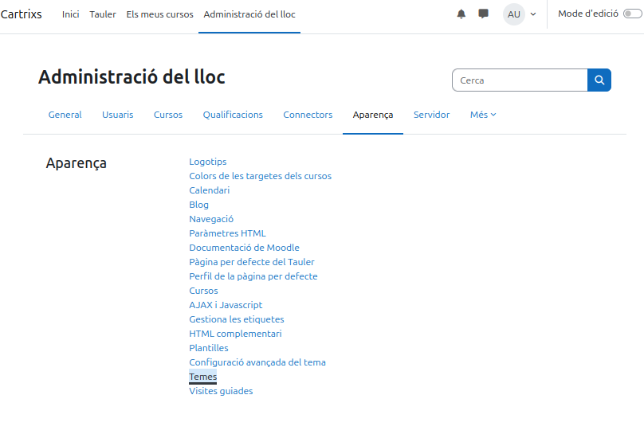
- Una vegada aqui escollim un de aquestes:
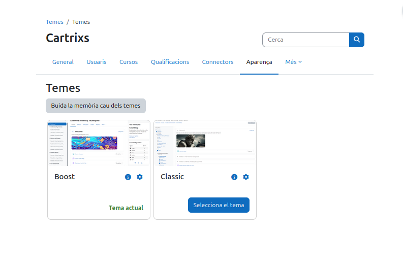
- En el meu cas he posat aixo:
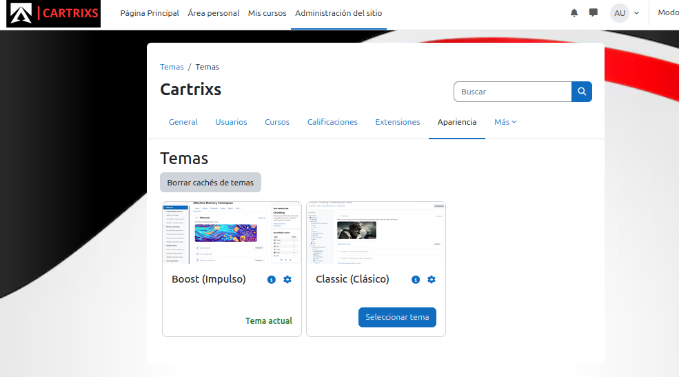
- Per ultim he afeix un logotip al moodle que es aquet:

-------------------------------------------------------------------

## 7. Creació de continguts i activitats

7.1 Per fer aquest punt tenim que asignar un professor i matricular alumnes. I després figa activitas amb data d'entrega.
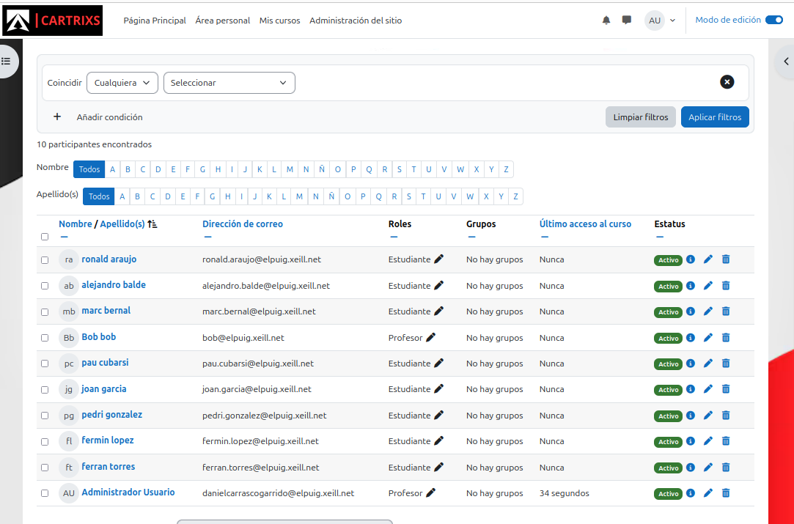 
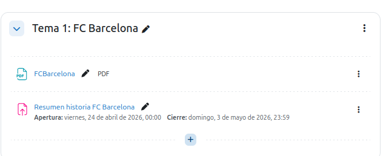 

7.2. Per fer aquesta part hem de fer el Curs B, Cloneu el contingut del curs A al curs B: Accediu a Administració del curs i feu clic a Importar. Per fer la importació del Curs A al Curs B, hem d'anar al curs on volem importar i després fer clic en Més i seleccionar "Reutilització del curs", a continuació triem el curs (en aquest cas, el Curs A) i fem clic a import.

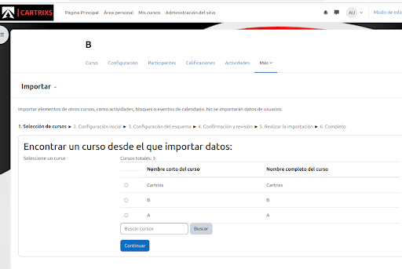 
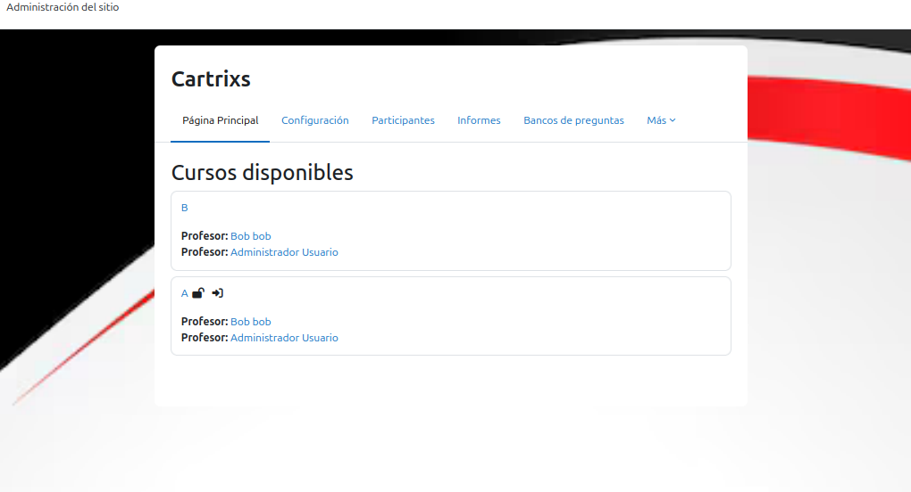 

-------------------------------------------------------------------------

## 8. Qualificacions i insígnies

8.1 Qualificacions: Per fer aixo he iniciat seccio amb un altre usuari i he enviat una tasca. D'espres he tornat al meu rol de professor i la he corregit. Després he configurat el sistema de qualificació automàtica des del qualificador.
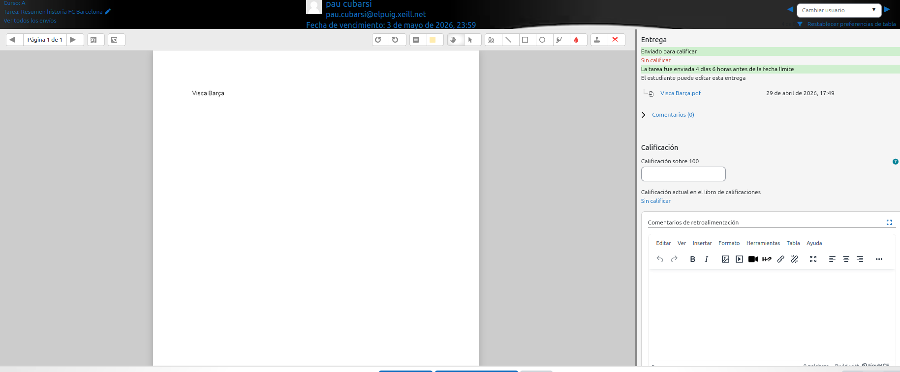 
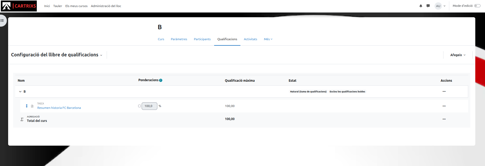 

8.2 Insígnies: Per poder crear usuaris tendrem que anar a Administració del lloc, després tindrem que buscar la seccio d'insignies i entrem hon posa Crear nova insignia, i la creem.
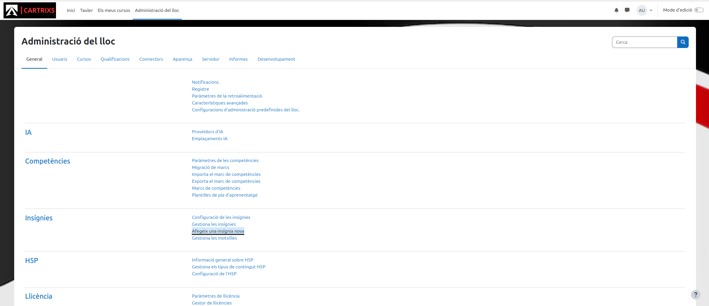 
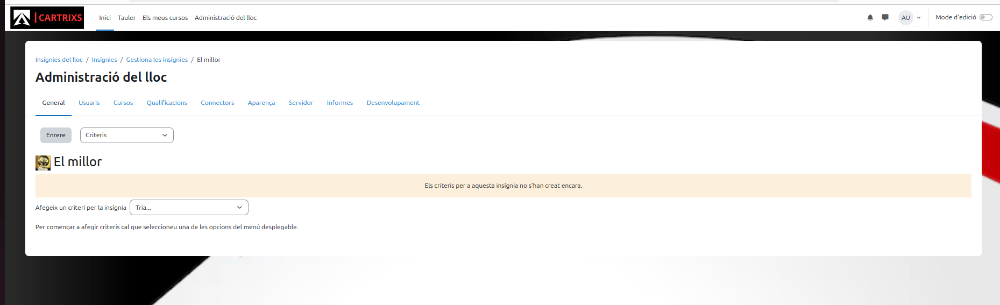 

---------------------------------------------------------------------------------------

## 9. Qüestionaris

He creat un qüestionari dins del curs A per avaluar els alumnes, utilitzant el banc de proves.
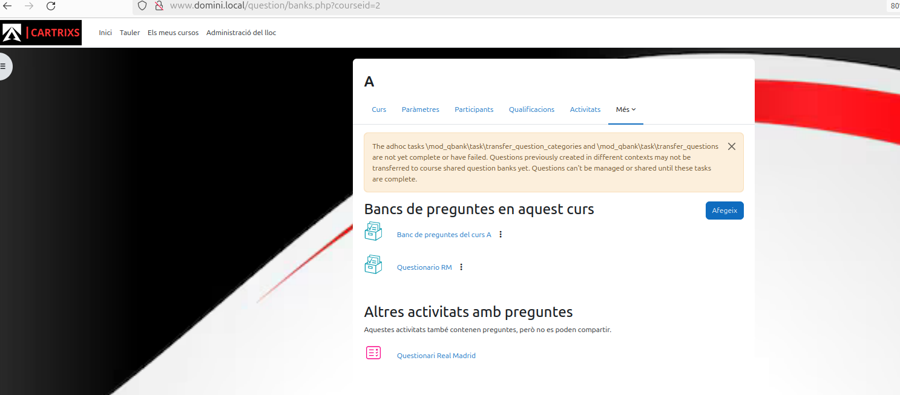 

-------------------------------------------

## 10. Importació i exportació de cursos

Exporteu una còpia de seguretat del curs, per fer la copia de seguretat tenim que anar a
Administració > Cursos > Reutltzacio del curs.

