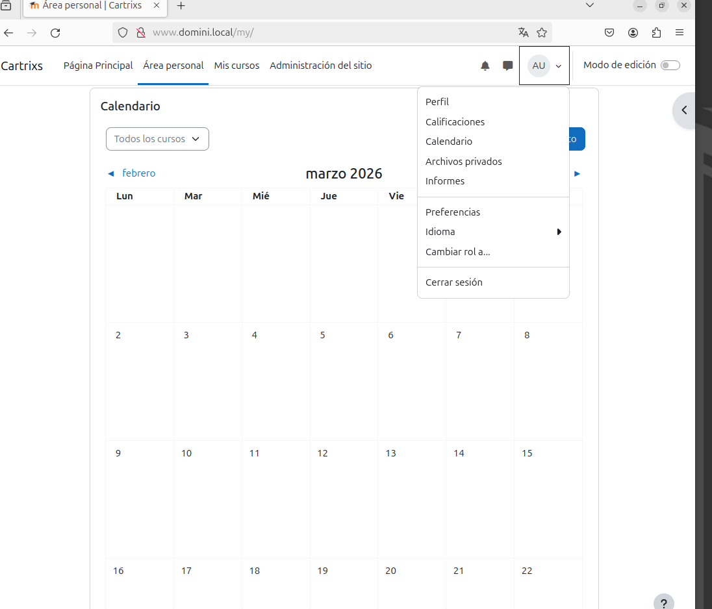
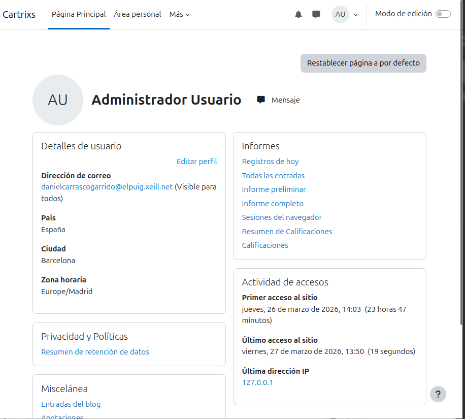
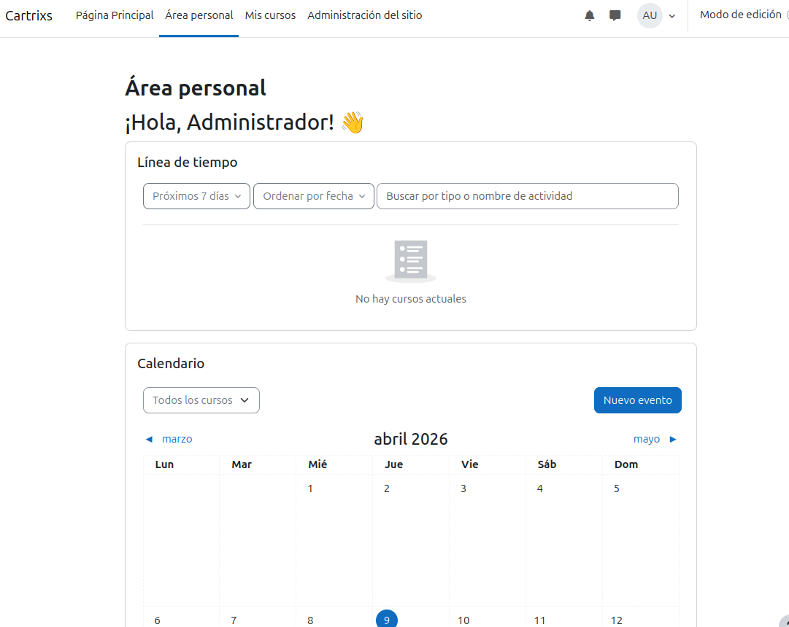
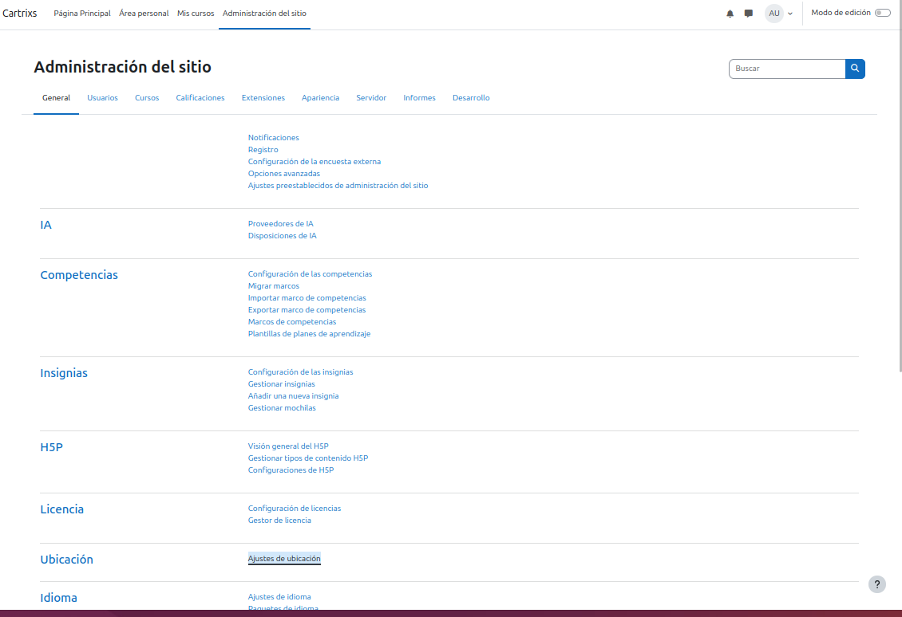
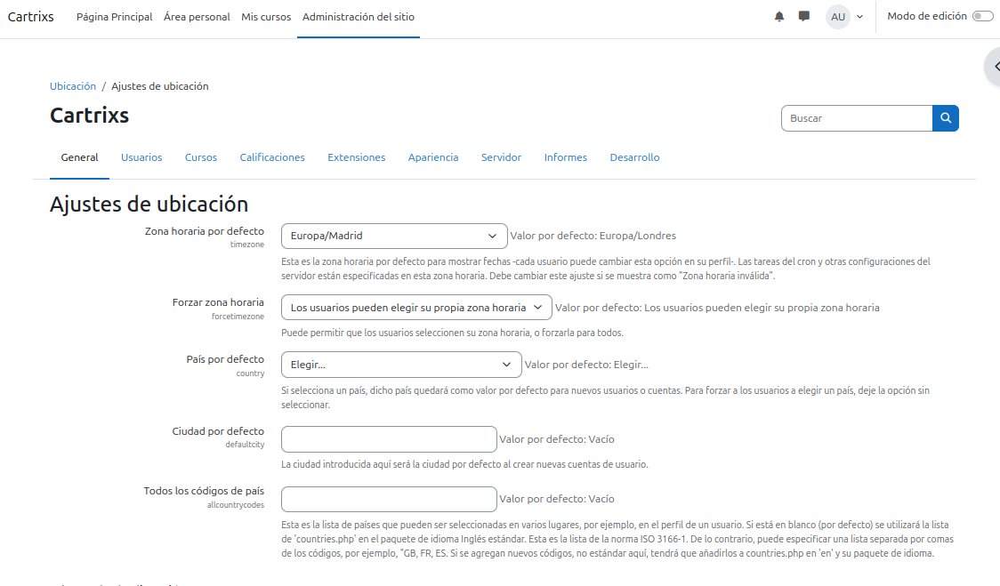
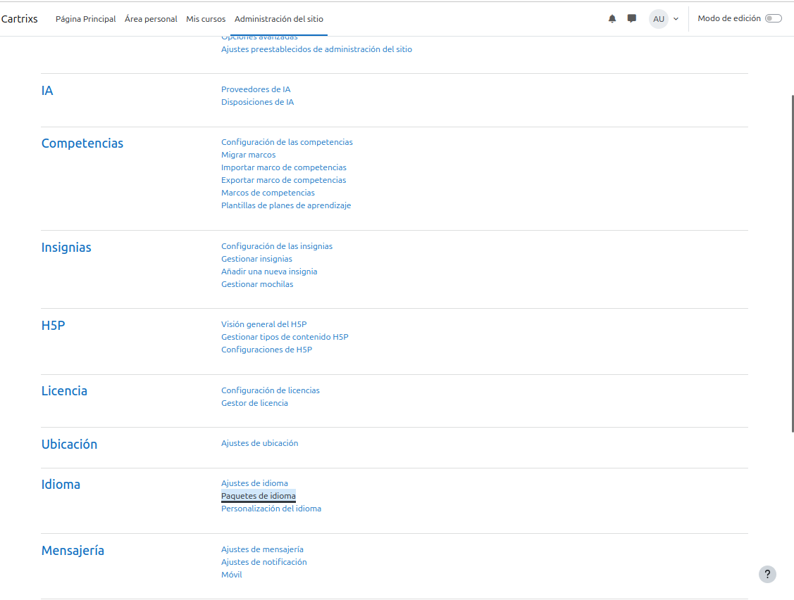

# Practica-Tema-4-Instalacion-i-Configuracion-de-Moodle
En aquesta pràctica he creat un portal Moodle de temàtica lliure, configurant-lo i explorant-ne les funcionalitats com a administrador.
## Configuració inicial de Moodle

Per fer aquest apartat de la pràctica, he iniciat la sessió com a administrador i havia canviat el meu correu electrònic i la contrasenya seguint aquests passos:

Per començar he fet click en el **Logo** del meu perfil del *Moodle*, i després en l’opció de **"Perfil"**

- Una vegada dins de l’apartat de perfil, hem de fer clic a **"Edit Profile"**

- En aquest apartat ja ens sortirà l’opció de configurar les nostres dades com: "correu electrònic, nom, contrasenya..."

## Configuració del lloc
En el punt *2* he canviat el nom del lloc i també he fet que la pàgina principal no mostri contingut per als usuaris no autenticats amb aquests passos: 
- Primer de tot iniciem la sessio com **Administrador** en *Moodle*.

- Ara anem a Administració del lloc > Primera plana > Paràmetres.
- Després configurem la franja horaria correcta:  Ubicació > Paràmetres.

- Jo, he escollit ***Europe/Madrid*** perque estic a Espanya.
- Ara per poder instalar idiomes tenim que anar a paquets d'idiomes.

