# Practica-Tema-4-Instalacion-i-Configuracion-de-Moodle
En aquesta pràctica he creat un portal Moodle de temàtica lliure, configurant-lo i explorant-ne les funcionalitats com a administrador.
## Configuració inicial de Moodle

Per fer aquest apartat de la pràctica, hem d'iniciar la sessió com a administrador i canviar el teu correu electrònic i la contrasenya seguint aquests passos:

Per començar he fet click en el Logo del meu perfil del Moodle, i després en l’opció de Perfil

- Una vegada dins de l’apartat de perfil, hem de fer clic a Editar perfil

- En aquest apartat ja ens sortirà l’opció de configurar les nostres dades com: "correu electrònic, contraseña, nom..."

## Configuració del lloc
Per configurar el lloc hem d'iniciar coom a administrador, quant ja estem dins del lloc ens apareixera a la primera plana.

- Ara anem a Administració del lloc > Primera plana > Paràmetres.
- Després configurem la franja horaria correcta:  Ubicació > Paràmetres.

- Jo, he escollit ***Europe/Madrid*** perque estic a Espanya.
- Ara per poder instalar idiomes tenim que anar a paquets d'idiomes.

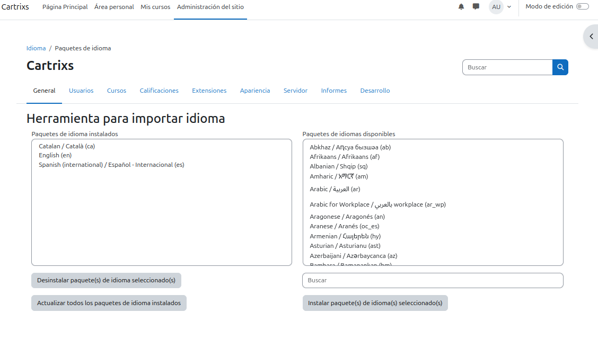
- Jo tinc instalat 3 idiomes: Espanyol (que es el que tinc pusat), El Català i per ultim l'angles.
- Ara per poder canviar la seguretat del lloc hem d'anar a on diu seguretat i aball apareixera normatives del lloc, li fem click per poguer entrar.
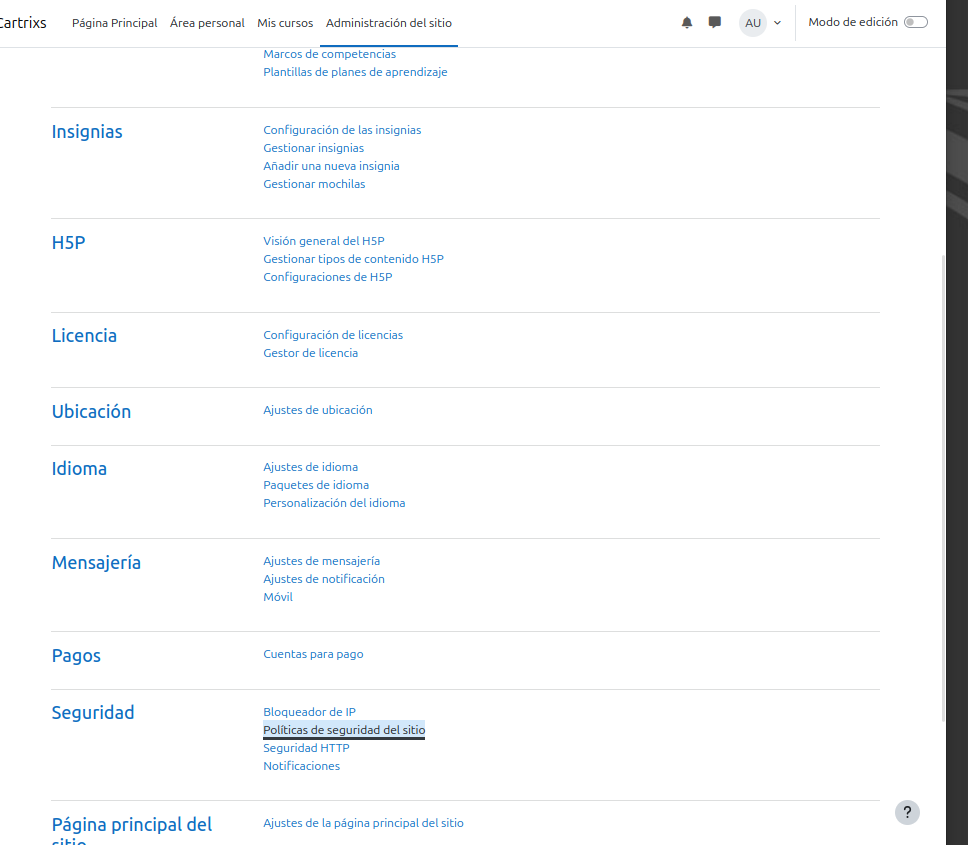
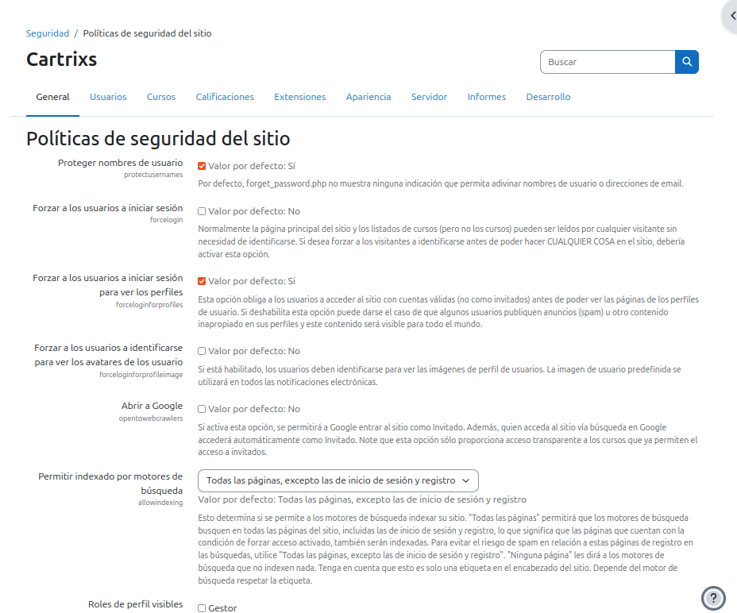
- Quan estem dins ja podem canviar tots els parametres que vulguem sobre seguretat

## Creació de cursos
Per crear un curs hem d'anar a configuracio del lloc i despres quan estem dins donar-li a cursos
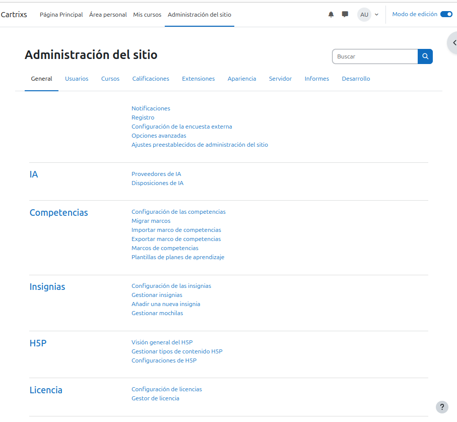
- Ara per poder crear un curs lim de donar a crear curs, quant li clickem ens surtira aixo, i li hem de donar nom com a "A".
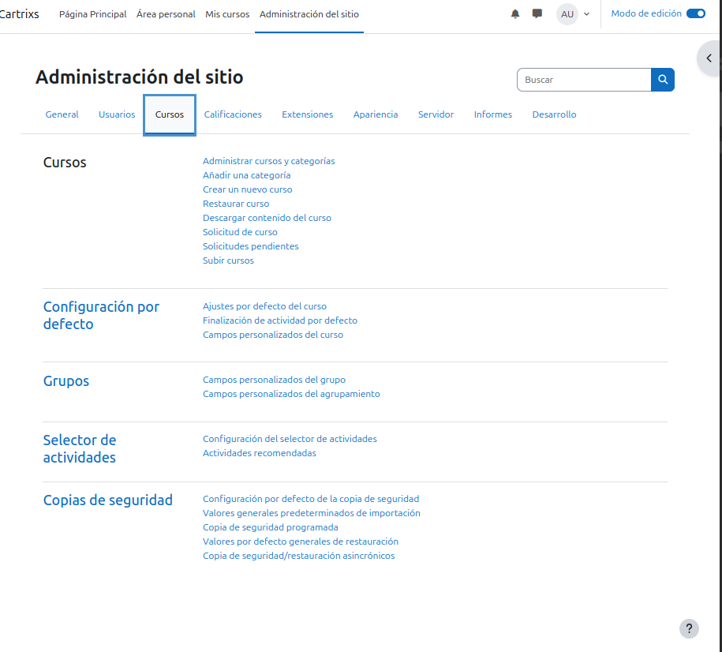
- Quan hem configurar tots el curs hem de crear per aquest primer curs 3 temes, en el meu cas jo els he renombrat com a : Barça, Real Madrid i Juventut de Badalona.
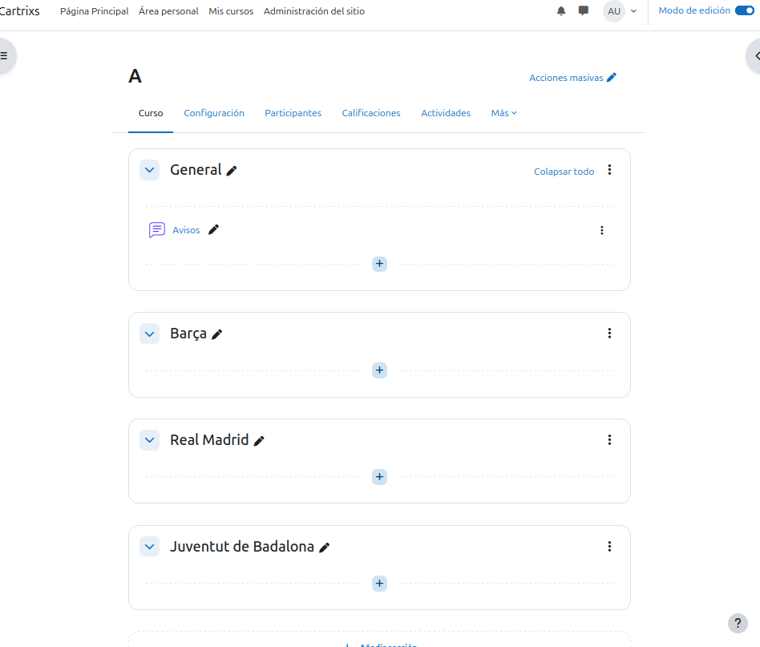
- Quan hem posat nom a tots els temes fiquem un pdf a un tema, en el meu cas he ficat un pdf al tema Barça.
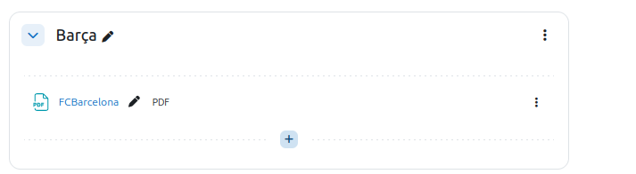

## Creació i gestió d'usuaris
Per pogue crear un usuari ens hem d'anar a configuracio del lloc i després a creacio d'usuaris.
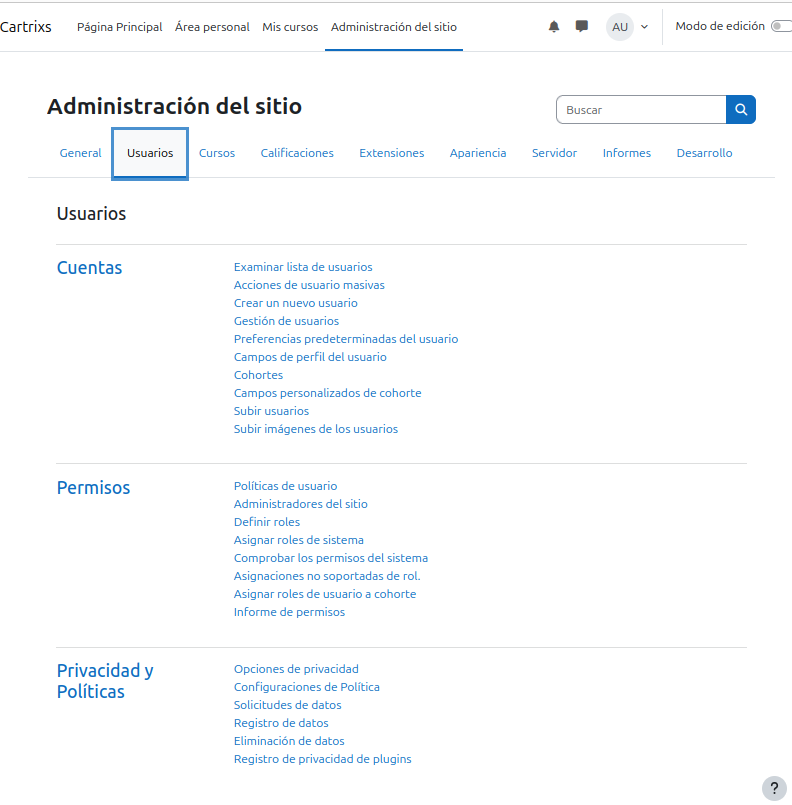
Ara el que tenim que crear es un usuari que li anomenem Bob.
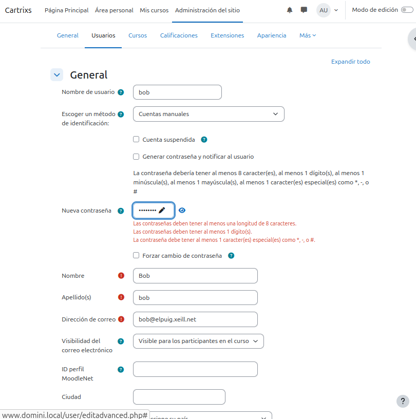
Apara per poder fer la segona part d'aquet punt hem d'nar un altre cop a usuaris i ara li hem de de d'onar a carrega usuaris, quan estem dins fiquem l'arxiu CSV que hem creat.
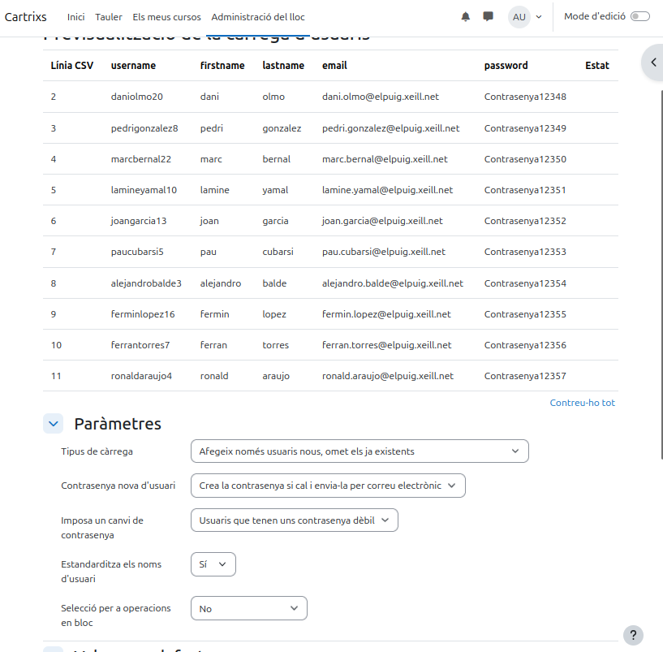

## Matriculació d'usuaris als cursos (Desde aqui hay que hacer)
5.1. Configuració de mètodes d'inscripció

Per fer el curs em de Desactiva qualsevol mètode d'inscripció per fer-lo públic. El curs ha de ser accessible sense iniciar sessió. 

I per el curs B hem de fer el registre manual d'usuaris. Matriculeu l'usuari Bob com a professor i els alumnes restants com a estudiants.
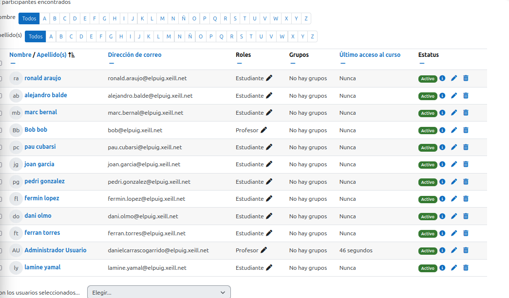
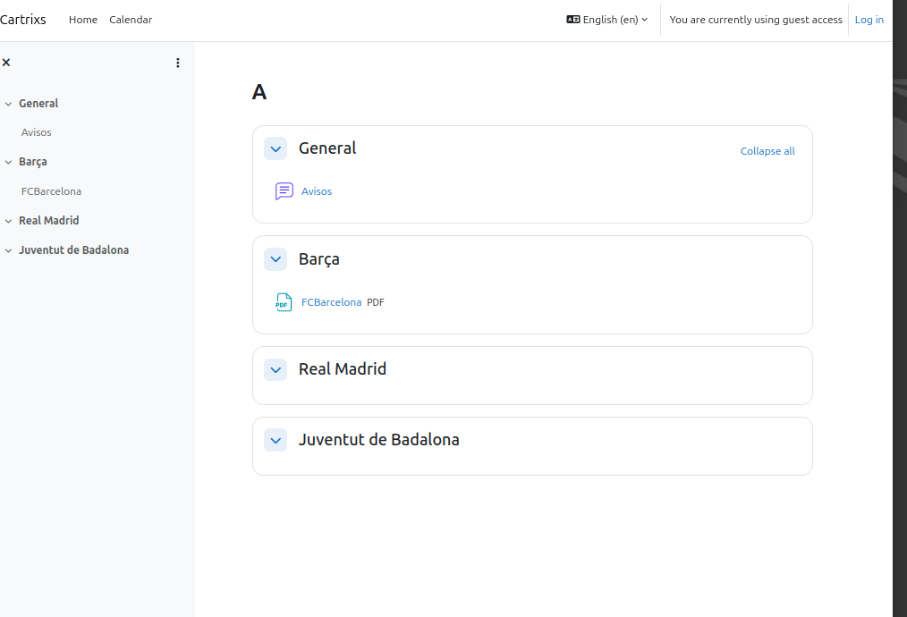

5.2. Verificació del contingut del curs A està disponible públicament.
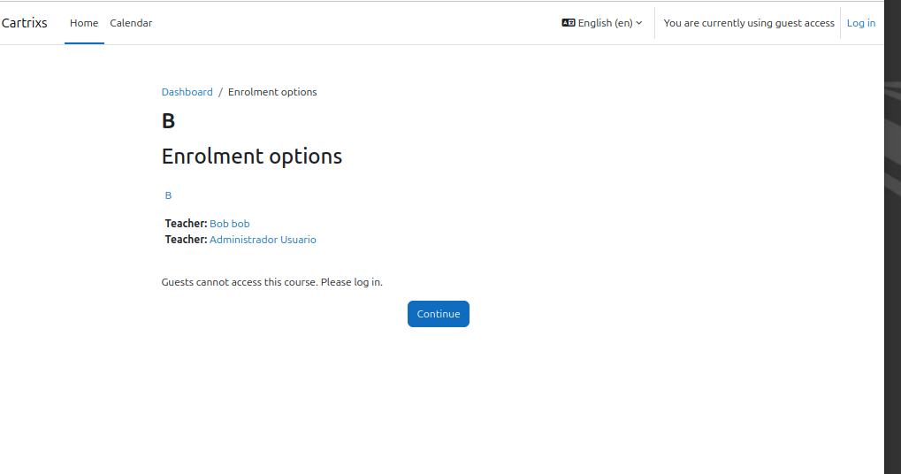
Per accedir al curs B, cal iniciar sessió.
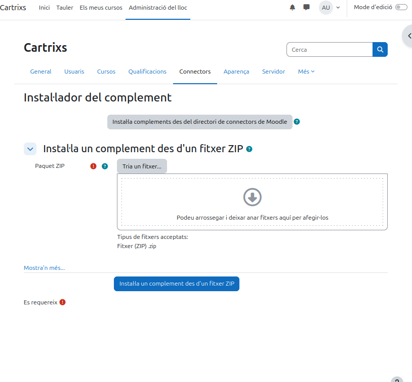

# 6. Personalització del lloc
- Descarregueu i activeu un tema nou:
- Anar a Administració del lloc > Connectors > Instal·lar complement.
